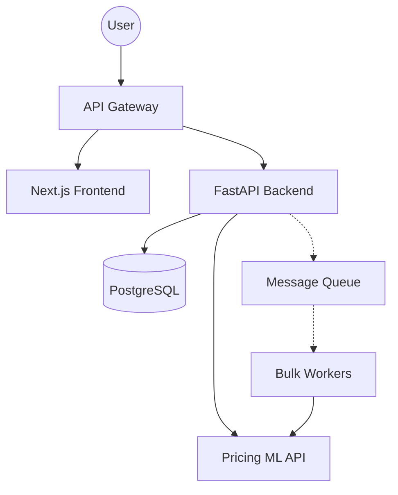

# System Architecture Design: Property Valuation Portal

A simple, cloud-ready microservice architecture for the property valuation system.

## 1. Architecture Diagram (Mermaid)

## 2. Key Services

1.  **Next.js Frontend**: The user interface for valuation and market data.
2.  **FastAPI Backend**: Manages app logic, user history, and coordinates requests.
3.  **Pricing ML API**: A standalone service that runs the machine learning model.
4.  **Bulk Workers**: Background processes that handle large CSV uploads using a queue.

## 3. Communication & Security

- **API Gateway**: A central entry point (e.g., Kong) handles SSL/TLS termination, rate limiting, and request routing.
- **Service Discovery**: Kubernetes CoreDNS manages internal networking (e.g., `http://pricing-api.ml-namespace:8080`).
- **Network Security**:
  - **Private Subnets**: Backend and ML services reside in private subnets with no direct public access.

## 4. Data Flow

1.  **Input**: User submits property data or a CSV file.
2.  **Logic**: The Backend validates the data and saves it to the Database.
3.  **Prediction**: The Backend (or Bulk Workers) calls the ML API to get an estimate.
4.  **Persistence**: Results are saved to **PostgreSQL**.
5.  **Notification**: User is notified via **WebSockets** or Polling that the report is ready.

## 5. Deployment & Monitoring

- **Docker**: Every part of the app is containerized for easy deployment.
- **Kubernetes**: Used for scaling services and handling high traffic.
- **CI/CD**: Automated pipelines (GitHub Actions) to build and deploy changes.
- **Monitoring**: Tools like Sentry and Prometheus track errors and system health.
