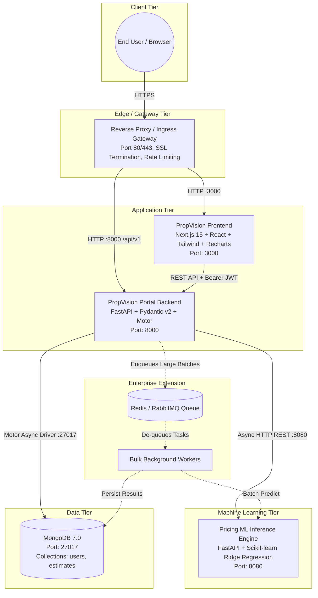
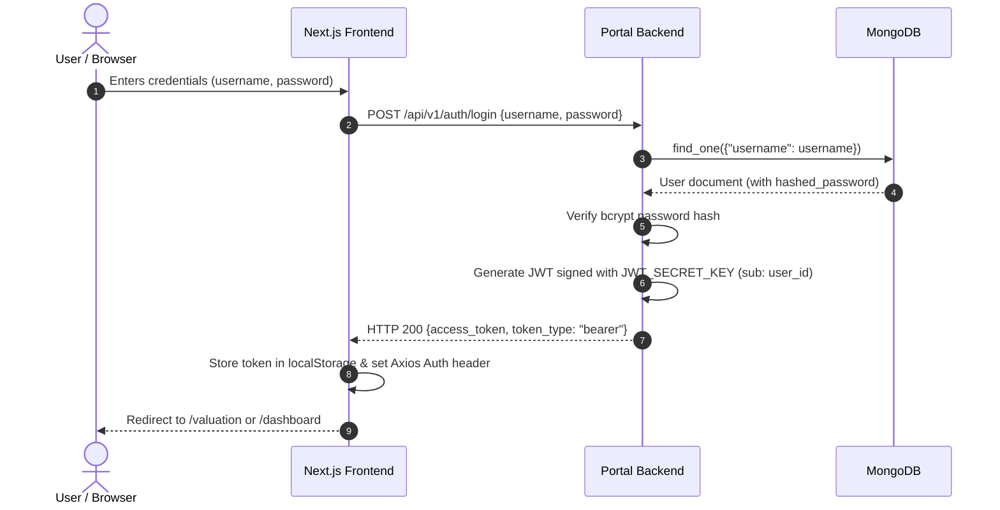
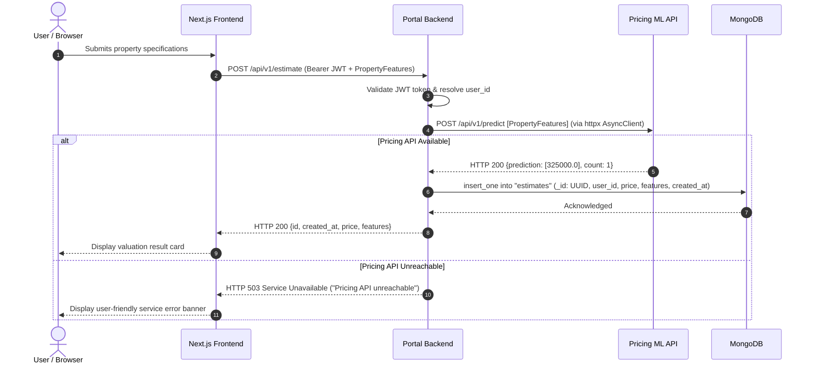
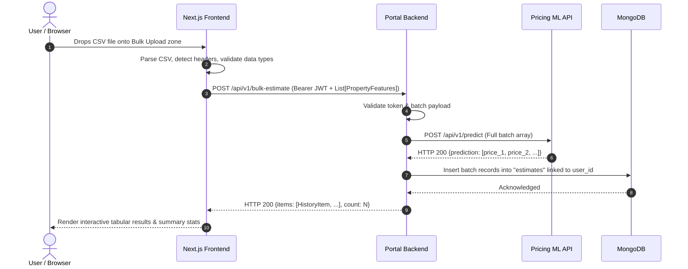
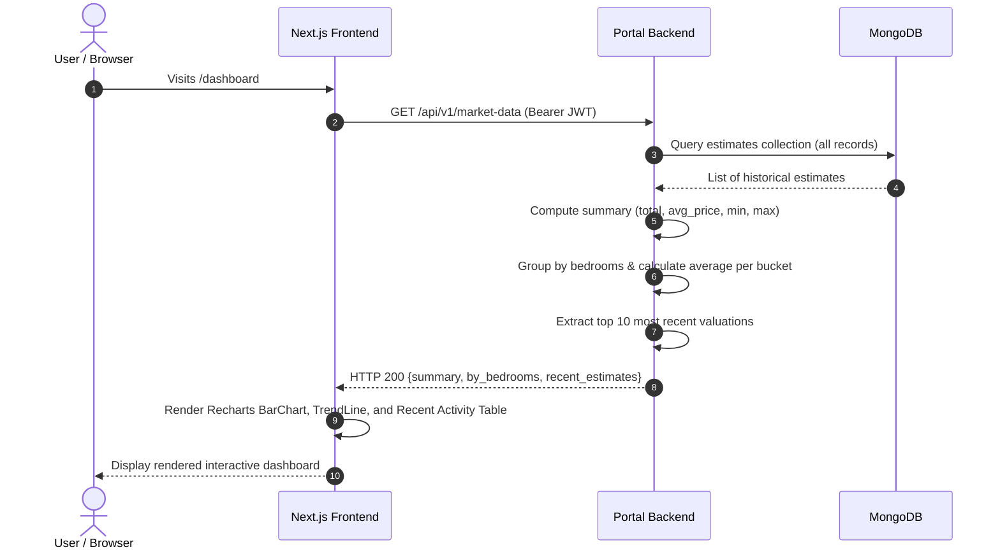

# PropVision – Housing Property Valuation System
## System Architecture & Engineering Design Document

---

## 1. Executive Summary & Design Principles

**PropVision** is an enterprise-ready property valuation and market intelligence platform. The architecture is engineered around three core principles:

1. **Separation of Concerns**: Machine learning model training, inference, and versioning are strictly isolated in a dedicated microservice (**Pricing API**), decoupling computational workloads from customer-facing business logic (**Portal Backend**) and user interface presentation (**Portal Frontend**).
2. **Asynchronous & Non-Blocking I/O**: Both backend services leverage Python's `asyncio` ecosystem (`FastAPI`, `httpx.AsyncClient`, and `Motor` async driver for MongoDB) to achieve high concurrent throughput without thread starvation.
3. **Defense in Depth**: Endpoints are secured using stateless JWT authentication with bcrypt password hashing, input validation at service boundaries using Pydantic, and isolated internal networks for data stores and ML engines.

---

## 2. High-Level Architecture Diagram



---

## 3. Microservice Specifications

### 3.1 PropVision Portal Frontend (`port 3000`)
- **Framework**: Next.js 15 (App Router), React, TypeScript.
- **Styling & Visualization**: Tailwind CSS, Recharts (responsive line charts, bar charts, KPI cards), Lucide icons.
- **Key Responsibilities**:
  - **Single Valuation**: Interactive forms with real-time client-side validation for instant appraisals.
  - **Bulk Valuation**: Client-side CSV ingestion, drag-and-drop support, header auto-mapping, and batch progress tracking.
  - **Market Analytics Dashboard**: Aggregate statistics (Total Estimates, Average Price, Min/Max), segment breakdown by bedroom counts, and recent valuations.
  - **Authentication Management**: User registration, login, and token rehydration from `localStorage` into Axios default headers.

### 3.2 PropVision Portal Backend (`port 8000`)
- **Framework**: FastAPI (Python 3.12+), Uvicorn, Pydantic Settings, Motor.
- **Key Responsibilities**:
  - **Authentication & Authorization**: Password hashing via `bcrypt`, issuing signed JWT access tokens (`HS256`, 24h TTL), and route protection via `HTTPBearer` dependencies.
  - **Service Orchestration**: Proxies valuation requests to the Pricing API using a pooled `httpx.AsyncClient` instance with connection pooling.
  - **Persistence & Audit Trail**: Stores valuation events in MongoDB tied to the authenticated user ID and timestamp.
  - **Market Analytics Engine**: Aggregates valuations across the entire system using MongoDB queries to compute distribution metrics.
  - **Resilient Error Propagation**: Translates upstream network failures into explicit HTTP status codes (HTTP 503 if Pricing API is unreachable, HTTP 502 if Pricing API returns an invalid schema).

### 3.3 Pricing ML Inference API (`port 8080`)
- **Framework**: FastAPI (Python 3.12+), Scikit-learn, Pandas, NumPy.
- **Key Responsibilities**:
  - **Startup Lifecycle Training**: Loads `House Price Dataset.csv` at application launch, fits a `Pipeline([('scaler', StandardScaler()), ('regressor', Ridge(alpha=1.0))])`, and evaluates validation metrics on an 80/20 train/test split.
  - **Low-Latency Inference**: Vectorizes JSON input records into NumPy 2D matrices for high-throughput single and batch predictions via `POST /api/v1/predict`.
  - **Model Governance & Introspection**: Exposes learned coefficients, intercept, dataset name, and metrics ($R^2$, MAE, MSE, RMSE) via `GET /api/v1/model-info`.

### 3.4 MongoDB Persistence Layer (`port 27017`)
- **Engine**: MongoDB 7.0 Community Edition.
- **Database**: `propvision`.
- **Key Collections**:
  - `users`: Stores user credentials (`username`, `hashed_password`, `full_name`).
  - `estimates`: Stores valuation records (`_id`, `user_id`, `created_at`, `price`, `features`).

---

## 4. Sequence Flows & Interactions

### 4.1 Authentication Flow (Login & Token Exchange)



---

### 4.2 Single Property Valuation Flow



---

### 4.3 Bulk CSV Valuation Flow



---

### 4.4 Market Data Aggregation Flow



---

## 5. Data Architecture & Indexing Strategy

### 5.1 MongoDB Collections Schema

#### Collection: `users`
```json
{
  "_id": "ObjectId('6507a1b2c3d4e5f6a7b8c9d0')",
  "username": "janedoe",
  "hashed_password": "$2b$12$K8qE6...bcrypt_hash...",
  "full_name": "Jane Doe"
}
```

#### Collection: `estimates`
```json
{
  "_id": "9b1deb4d-3b7d-4bad-9bdd-2b0d7b3dcb6d",
  "user_id": "6507a1b2c3d4e5f6a7b8c9d0",
  "created_at": "2026-09-30T00:15:30.123Z",
  "price": 348500.0,
  "features": {
    "square_footage": 2100.0,
    "bedrooms": 3.0,
    "bathrooms": 2.5,
    "year_built": 2005.0,
    "lot_size": 6500.0,
    "distance_to_city_center": 4.2,
    "school_rating": 8.5
  }
}
```

### 5.2 Indexing Strategy

To guarantee sub-millisecond query performance as dataset volume scales:

1. **Unique User Index**:
   ```python
   db["users"].create_index([("username", ASCENDING)], unique=True, name="users_username_unique")
   ```
   - Prevents race conditions during simultaneous user registrations.
   - Accelerates user lookup during login to $O(1)$ logarithmic B-Tree seek time.

2. **Compound Index for User History**:
   ```python
   db["estimates"].create_index(
       [("user_id", ASCENDING), ("created_at", DESCENDING)],
       name="estimates_user_id_created_at"
   )
   ```
   - Satisfies queries filtering by `user_id` and sorting by `created_at` descending (`GET /api/v1/history`) with index-covered scans, avoiding full in-memory sorting.

---

## 6. Security & Defense Architecture

1. **Password Hashing**: Passwords are never stored in plaintext. They are salted and hashed using `bcrypt` (work factor 12) via `passlib`.
2. **Stateless JWT Authorization**:
   - Access tokens are signed using HMAC-SHA256 (`HS256`).
   - The token `sub` claim encodes the user's MongoDB `ObjectId` string, making token verification decoupled from mutable usernames.
   - Tokens carry an explicit expiration timestamp (`exp`), defaulting to 24 hours.
3. **Route Guarding**: All sensitive endpoints (`/estimate`, `/bulk-estimate`, `/history`, `/market-data`, `/auth/me`) require the `get_current_user` FastAPI dependency, returning HTTP 401 if the token is missing, expired, or tampered with.
4. **Network Isolation**: In production topologies, only the API Gateway and Frontend are exposed to public ingress. The Portal Backend, Pricing API, and MongoDB reside in a private virtual network (VPC / Docker bridge network) with no external port exposure.
5. **CORS Governance**: Cross-Origin Resource Sharing is centrally configured in `middlewares/middleware.py`. In staging and production environments, origins are restricted strictly to approved web domains.

---

## 7. Resilience, Fault Tolerance & Error Handling

| Scenario | System Behavior | HTTP Response Code |
| :--- | :--- | :--- |
| **Pricing API is Down** | `httpx.RequestError` caught in `EstimateService` | `503 Service Unavailable` with descriptive message |
| **Pricing API Returns Error** | `httpx.HTTPStatusError` caught | `502 Bad Gateway` detailing upstream status |
| **Invalid Input Data** | Pydantic validation interceptor triggers | `422 Unprocessable Entity` listing field errors |
| **Duplicate Username** | Pre-check on `users` collection | `409 Conflict` ("Username already taken") |
| **Expired / Tampered JWT** | `jwt.PyJWTError` caught in token decoder | `401 Unauthorized` (`WWW-Authenticate: Bearer`) |
| **MongoDB Down at Startup** | `await db.client.admin.command('ping')` fails | Process exits immediately (Fail-Fast pattern) |

---

## 8. Scalability & Performance Engineering

1. **Persistent Connection Pooling**:
   - `httpx.AsyncClient` is instantiated once in the FastAPI `lifespan` handler and stored on `app.state.http_client`. This eliminates the TCP handshake and SSL overhead on every ML prediction call.
   - `Motor` connection pooling handles concurrent database requests asynchronously.
2. **Batch ML Vectorization**:
   - Instead of iterating through properties sequentially, the Pricing API converts the list of property dictionaries into a single 2D NumPy array:
     $$\mathbf{X} \in \mathbb{R}^{N \times 7}$$
   - Scikit-learn's underlying optimized C/BLAS routines execute batch matrix multiplication in a single SIMD vector pass, enabling sub-10ms response times for hundreds of properties.
3. **Enterprise Asynchronous Scaling (Phase 2 Roadmap)**:
   - For bulk operations exceeding 1,000 properties, the platform can be extended with a Redis-backed Celery worker pool:
     - Portal Backend pushes the bulk request payload to a task queue and immediately returns a job ticket (`job_id`).
     - Worker processes stream predictions from the Pricing API and write chunks to MongoDB.
     - Frontend tracks progress using Server-Sent Events (SSE) or WebSocket push notifications.

---

## 9. Production Deployment Blueprint (Docker & Kubernetes)

### 9.1 Docker Compose Deployment
The provided `docker-compose.yml` configures an isolated network (`propvision-network`) with health-checked dependency graphs:
- `mongodb` starts first with authenticated root credentials.
- `pricing-api` starts and initializes its regression model.
- `propvision-backend` depends on both `mongodb` and `pricing-api`.
- `propvision-frontend` depends on `propvision-backend`.

### 9.2 Kubernetes Deployment Strategy

```
                          ┌───────────────────────────────┐
                          │   Ingress Controller (NGINX)  │
                          └───────┬───────────────┬───────┘
                                  │               │
                     Path: /      │               │ Path: /api/v1
                                  ▼               ▼
                      ┌────────────────┐   ┌────────────────┐
                      │ Frontend Pods  │   │  Backend Pods  │
                      │  (HPA: 2-10)   │   │  (HPA: 3-20)   │
                      └────────────────┘   └───────┬────────┘
                                                   │
                                                   ├──► Internal ClusterIP: pricing-api:8080
                                                   │    (Pricing API Pods, HPA: 2-10)
                                                   │
                                                   └──► StatefulSet / Managed: MongoDB ReplicaSet
```

- **Horizontal Pod Autoscaling (HPA)**: Backend and Pricing API scale automatically based on CPU utilization and request counts.
- **ConfigMaps & Secrets**: Sensitive values (`JWT_SECRET_KEY`, database credentials) are injected via Kubernetes Secrets.
- **Readiness & Liveness Probes**: Configured on `/health` for seamless rolling deployments without dropped connections.

---

## 10. Observability & Monitoring

1. **Structured Logging**: Standardized JSON log formatting across backend services with correlation IDs (`X-Request-ID`) to trace user operations across the Frontend, Backend, and Pricing API.
2. **Metrics Collection**: Prometheus scraping endpoints can be plugged into FastAPI to collect:
   - Request latency histograms ($p_{50}, p_{95}, p_{99}$).
   - Inference duration in Pricing API.
   - MongoDB query execution times.
3. **Error Reporting**: Centralized error capture (e.g. Sentry) to notify engineering teams of unhandled exceptions in real time.
